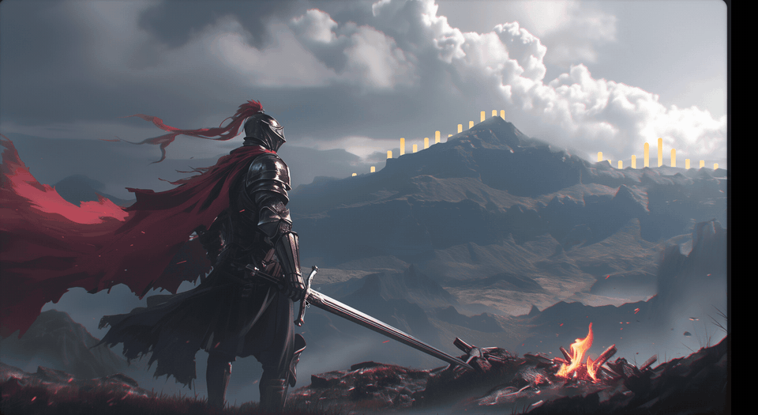
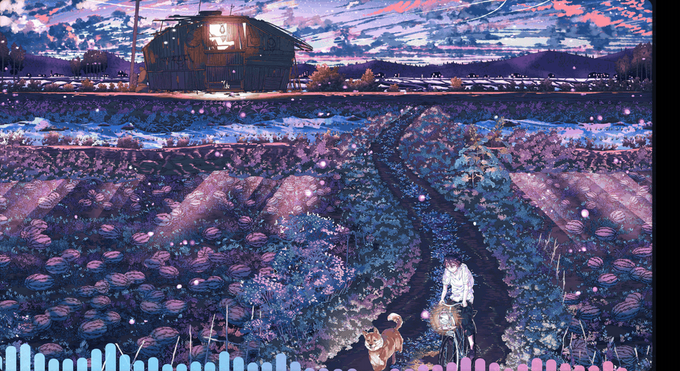
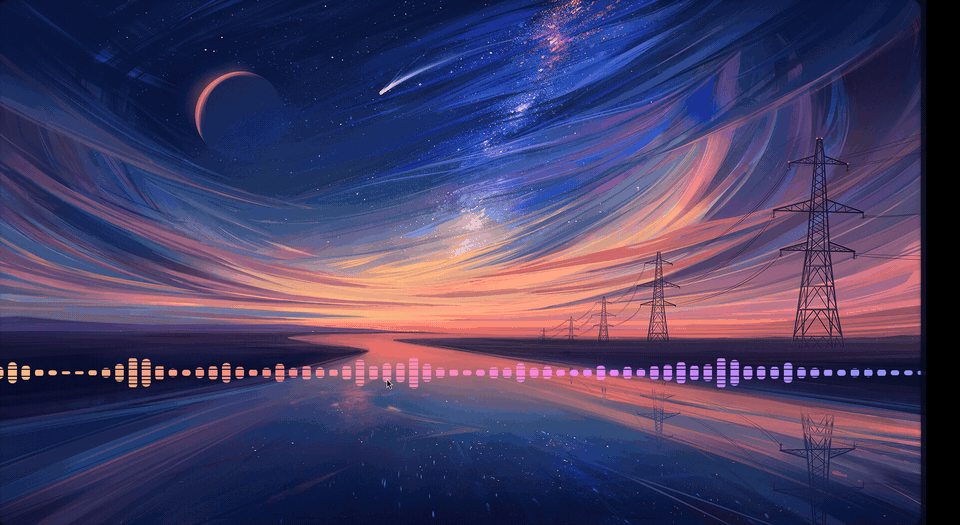
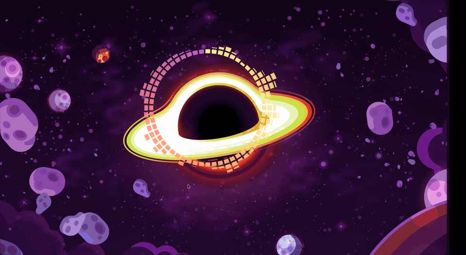
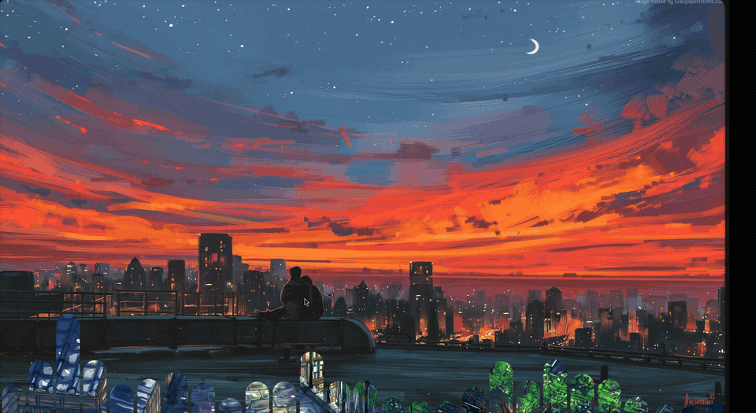
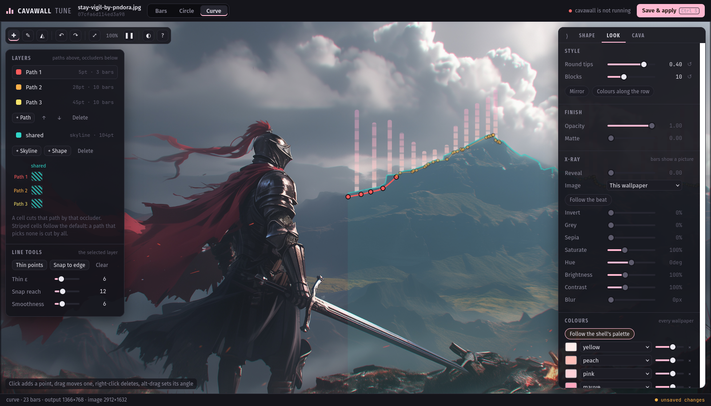

<h1 align="center">cavawall</h1>

<p align="center">A Wayland audio visualiser that draws <a href="https://github.com/karlstav/cava">cava</a> onto your wallpaper, behind your windows.</p>

<p align="center">
  
</p>

<p align="center">
  
  
  
  
</p>

A fork of [rs-pro0/wallpaper-cava](https://github.com/rs-pro0/wallpaper-cava)
## Features

### Bars that belong to the picture

Three figures: a **row**, a **circle**, and a **curve** - bars standing along a
path you draw over the wallpaper, following a ridge or a skyline, and hiding
behind whatever you mark as in front of them. Everything is placed on the
image, not the screen, so a figure lands on the same ridge on any monitor.

Each wallpaper keeps its own settings, keyed by the image's content: rename or
move the file and they follow it.

### Styles

<p align="center">
  
</p>

Rounded tips, LED-style blocks, colours up each bar or along the row, and
mirrored bars that reach both ways from their line.

<p align="center">
  
</p>

<p align="center">
  
</p>

### X-ray

<p align="center">
  
</p>

The bars become windows onto a hidden picture: the wallpaper itself through a
filter (inverted, desaturated, hue-shifted, blurred), or any picture you pick.
It lines up pixel for pixel with the wallpaper underneath, and can follow the
beat - quiet bars keep their colour, loud ones show the picture.

### The editor

<p align="center">
  
</p>

`cavawall tune` opens an editor in your browser: the current wallpaper, with a
live preview in the real gradient over the part your monitor shows. Save
applies everything to the running visualiser in place.

- **Shape**: drag the row, the circle or a curve's points on the image; bar
  count, height, placement, anchors
- **Look**: rounded tips, blocks, mirror, colours along the row, opacity and
  matte; the x-ray with its picture and filters; the palette, stop by stop
- **Cava**: input source, sensitivity, frame rate, smoothing; which monitor
  and what a fullscreen window does; where the wallpaper and palette come
  from; notifications
- A **layers card** for a curve's paths and occluders, with a grid of which
  occluder hides which path; it folds away. The **point editor** opens next
  to the selected point. The settings panel can be **dragged anywhere**
- Undo, redo, and a warning for unsaved changes. Settings shared by every
  wallpaper are written into `config.toml` with its comments kept

### Live colours, any setup

The gradient can follow a live palette and changes in place, with no restart:
Caelestia's, pywal's, or any JSON file a theme tool writes. The wallpaper is
followed the same way - from Caelestia, swww, waypaper, a file, or a command
of your own - so each wallpaper gets its own figure whatever sets it.

### Behaves on any setup

- **Steps aside for fullscreen windows** (`on_fullscreen`): moves to a free
  monitor, or unmaps and suspends cava until one is free. Hyprland through its
  IPC; Sway, river, niri, labwc and Wayfire through foreign-toplevel. Off by
  default, and off costs nothing
- **Notifications** for errors and crashes - optionally starts and stops -
  through your notification daemon, Hyprland, or a command
- **A log and a reason for every exit**: `cavawall log` shows what happened
  and `cavawall log last-exit` why it last stopped, a crash included. Every
  failure a user can meet says what to do about it

### Cheap to leave running

It runs all day, so it is built to cost nothing when it can:

- **One draw call per frame**, whatever the figure: a curve with several paths
  and occluders included. Occluders are rasterised once, when the surface is
  placed, into a bitmask the bars test.
- **Two bytes per bar per frame** reach the GPU: cava's own output, copied into
  a persistently mapped buffer. A frame identical to the last is not drawn.
- **Styles you do not use are not compiled in.** Each is a shader variant, so
  plain bars run plain shaders.
- **Silence parks it.** After half a second of silence nothing is drawn or
  committed; with `sleep_timer` cava stops analysing too.
- **Event-driven**, one thread, no polling: cava's pipe, the control socket,
  config changes and Wayland all wake the same loop.
  
## Installation

Needs a Wayland compositor with `wlr-layer-shell` (Hyprland, Sway, river,
niri), OpenGL 4.3, and [cava](https://github.com/karlstav/cava) on `PATH`.

```bash
git clone https://github.com/PatAmigo0/cavawall
cd cavawall
./install.sh
```

`install.sh` builds, installs `cavawall` to `~/.local/bin` with its helpers in
`~/.local/lib/cavawall`, and copies the annotated
[`config.toml`](config.toml) to `~/.config/cavawall/` unless you already have
one. By hand:

```bash
cargo install --path . --root ~/.local
mkdir -p ~/.local/lib/cavawall
mv ~/.local/bin/{cavawallctl,cavawall-tune} ~/.local/lib/cavawall/
mkdir -p ~/.config/cavawall && cp config.toml ~/.config/cavawall/
```

Builds target the CPU they are built on (`target-cpu=native`). Packagers set
`RUSTFLAGS`, which takes precedence. An AUR package is planned.

## Usage

```bash
cavawall            # start the visualiser
cavawall tune       # edit the current wallpaper's figure
cavawall status     # what it is drawing
cavawall reload     # re-read the config, in place
cavawall refresh    # look again at the wallpaper, for a source it cannot watch
cavawall move DP-1  # move to another monitor; no name picks automatically
cavawall stop       # clear and exit
cavawall log        # what happened; log watch follows it live, log last-exit says why it last stopped
cavawall help       # everything else
```

Everything it prints also goes to `~/.local/state/cavawall/cavawall.log`, and
the reason the last instance stopped - a stop, a signal, an error, a crash -
to `last-exit`, so a failure is still readable when it happened with no
terminal attached.

Stop it with `cavawall stop` or SIGTERM, never SIGKILL: the exit path clears
the surface, and a hard kill can leave the last frame on the wallpaper.

On Hyprland, skip the layer's map animation, or a restarted shell can strand
it mid-fade:

```
layerrule = noanim, cavawall
```

## Configuration

`~/.config/cavawall/config.toml` holds the defaults; `cavawall tune` writes
per-wallpaper settings to `wallpapers/<key>.toml` beside it. The annotated
[`config.toml`](config.toml) documents every key.

| key | meaning |
|---|---|
| `general.mode` | `bars`, `circle` or `curve` |
| `general.framerate` | frames per second |
| `general.preferred_output` | monitor name; omit to prefer an external monitor over the laptop panel |
| `general.gl_driver` | `nvidia` or `mesa`: load only that EGL driver; on NVIDIA this skips Mesa and its LLVM, a quarter of cavawall's memory |
| `general.on_fullscreen` | `move` off a monitor a fullscreen window covers, `pause`, or `ignore` (default); Hyprland, or any compositor with foreign-toplevel |
| `general.channels`, `general.mono_option` | `mono` for one sweep across every bar; stereo mirrors the halves |
| `general.audio_source` | cava's input; omit for its default |
| `general.sleep_timer` | seconds of silence before cava sleeps; waking takes ~0.45s |
| `bars.amount`, `bars.gap`, `bars.max_height` | count, gap as a fraction of a bar, height |
| `bars.left`, `bars.span`, `bars.baseline`, `bars.grow` | place the row anywhere; `grow = "down"` hangs it |
| `bars.radius`, `bars.blocks`, `bars.mirror`, `bars.gradient` | styles |
| `bars.opacity`, `bars.matte` | alpha, and flattening the gradient toward its own mean |
| `bars.reveal`, `bars.reveal_pulse`, `bars.reveal_dir` | x-ray amount, follow the beat, where picked pictures are kept |
| `circle.*` | size, hole, alpha ramp, anchor and margins, or `position` |
| `curve.path`, `curve.occluder` | paths, and the named shapes that hide them (`cut_by`) |
| `colors.*` | gradient stops, base to tip |
| `scheme.colors`, `scheme.bars` | follow the live palette, and the shell's bar count |
| `scheme.source`, `scheme.path` | where the palette comes from: `caelestia`, `pywal`, or any JSON `file` |
| `wallpaper.source`, `.path`, `.command` | how it knows the wallpaper: `caelestia`, `swww`, `waypaper`, a `file` holding the path, or a `command` (then `cavawall refresh` after a change) |
| `smoothing.*` | passed to cava |
| `notify.*` | desktop notifications for errors, crashes, starts and stops, and how they are sent |

`CAVAWALL_OUTPUT=<name>` overrides the monitor without touching the file,
`CAVAWALL_DEBUG=1` reports placement and the exact config handed to cava, and
`CAVAWALL_LOG_DIR` moves the log.

A named monitor that is not connected maps nothing, rather than falling back
to one you did not ask for.

## How it works

cavawall spawns cava with raw 16-bit output and reads it from a non-blocking
pipe. Each frame's heights go straight to the GPU as per-instance data; the
bars are one instanced draw of a unit quad, shaped by the figure's shader. The
surface is a layer-shell layer sized to the figure, not the whole output, and
frames are paced by the compositor's frame callbacks.

Occluders, placement and the x-ray crop are computed once per configure. The
bar count and the figure are fixed at startup; changing either re-executes in
place, keeping the pid.

## License

GPL-3.0-or-later ([`LICENSE`](LICENSE)). Upstream was MIT; its notice is kept
in [`LICENSE.MIT`](LICENSE.MIT), covering the code inherited from it. Releases
up to and including `61be695` were published under MIT and stay available
under those terms.
